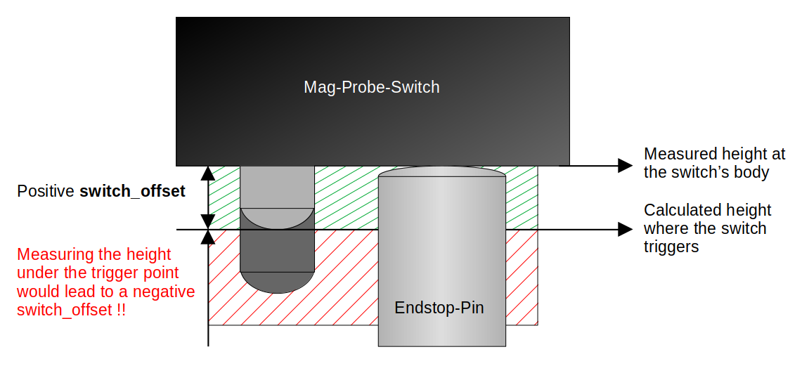

# Klipper plugin for a self calibrating Z offset

This is a plugin to self calibrate the nozzle offset to the print surface on a 3D printer
using Klipper. There is no need for a manual Z offset or first layer calibration any more.
It is possible to change any variable in the printer from the temperature, the nozzle,
the flex plate, any modding on the print head or bed or even changing the Z endstop
position value in the Klipper configuration. Any of these changes or even all of them
together do **not** affect the first layer at all.

Here is a small video for a short demonstration:
[https://streamable.com/wclrmc](https://streamable.com/wclrmc)

And now, we have a nice how-to from Kapman:
[https://youtu.be/oQYHFecsTto](https://youtu.be/oQYHFecsTto)

### If you are looking for a RRF version of this automatic Z offset calibration

Then, you can find it [here](https://github.com/pRINTERnOODLE/Auto-Z-calibration-for-RRF-3.3-or-later-and-Klicky-Probe) from pRINTERnOODLE - really fantastic to see this :tada:

### Many thanks for all your feedback to make this happen

And, if you love my work and would like to support me, please feel free to do this here:

[](https://ko-fi.com/X8X1C0DTD)

# Changes

- **v0.9.2** (2022-07-08)
  - The probe is now docked again before raising an error, if end_gcode is used (thanks to top-gun)
  - Probings are more consistent now as the probing sequence is also applied for the bed probing
  - More secure: the check for an attached probe is now after the movement to the probing site
- **v0.9.1** (2022-04-06)
  - The dummy system service for Moonraker's update manager is removed :tada:
  - **:exclamation:Please update this plugin and Moonraker, adapt your moonraker.conf and execute
    the install.sh script again!**
- **v0.9.0** (2022-04-05)
  - **CAUTION:** The X and Y position configurations are now merged to a combined X,Y parameter,
  - **:exclamation:Please update your Configuration!**
  - The CALIBRATE_Z command has an optional parameter for the probing position on the bed
  - The restriction for a relative reference index in the "bed_mesh" section is removed
  - Some other small changes from the failed Klipper PR are merged back now
  - Example configurations are removed because they were just examples and confused many people
- **v0.8.1** (2022-02-21)
  - Now, the relative reference index (RRI) of the bed mesh is read every time the calibration
    starts. So, feel free to use any adaptive mesh macro :tada:
  - Checks for homed axes and attached probe just before using it
  - A new Z-Tilt macro in the examples
  - Improvements of the documentation for installation, configuration and switch_offset
- **v0.8.0** (2021-08-09)
  - New configurations for executing G-Code commands (useful for V1 users)
  - Bugfix for configuring the z_calibration too early (many thanks to Frix-x),
  - New example configurations
  - **Action needed** for the Moonraker update, see: [Moonraker Update Manager](#moonraker-update-manager)
- **v0.7.0** (2021-06-23)
  - New "PROBE_Z_ACCURACY" command
  - Renaming of the dummy service (**CAUTION**: the configuration needs to be adapted for this!)
  - Fix in "_SET_ACC" Macro
- **v0.6.2** (2021-06-01)
  - As desired, added Moonraker Update possibility.
- **v0.5** (2021-05-30)
  - Added compatibility for newer Klipper versions.
- **v0.4** (2021-05-17)
  - The "calibrate_z:probe_bed_x|y" settings can be omitted in the configuration and the
  "mesh:relative_reference_index" of the bed mesh is taken as default instead.
- **v0.3** (2021-05-13)
  - A new option to first probe down fast before recording the probing samples is added.
  - And all indirect properties from other sections can be customized now.
- **v0.2** (2021-05-12)
  - The probing repeatability is now increased dramatically by using the probing
    procedure instead of the homing procedure!

# Table of Content

>:pray: **Please:** read this document carefully! Any details from feedbacks and trouble
>shootings are documented here!

- [Why This](#why-this)
- [Requirements](#requirements)
- [What It Does](#what-it-does)
  - [Drawback](#drawback)
  - [Interference](#interference)
  - [Example](#example)
  - [Thermal Frame Expansion](#thermal-frame-expansion)
- [How To Install It](#how-to-install-it)
  - [Moonraker Update Manager](#moonraker-update-manager)
- [How To Configure It](#how-to-configure-it)
  - [Preconditions](#preconditions)
  - [Configurations](#configurations)
  - [Bed Mesh](#bed-mesh)
  - [Switch Offset](#switch-offset)
- [How To Test It](#how-to-test-it)
- [How To Use It](#how-to-use-it)
  - [Command CALIBRATE_Z](#command-calibrate_z)
  - [Command PROBE_Z_ACCURACY](#command-probe_z_accuracy)
- [Ooze Mitigation](#ooze-mitigation)
- [Disclaimer](#disclaimer)

## Why This

- With a Z endstop where the tip of nozzle drives on the endstop switch (like the one in
  the Voron V1 or V2), you can exchange nozzles without adapting the offset:
  
- Or, by using a mag-probe (or SuperPinda, but this is not probing the surface directly
  and thus needs an other offset which is not as constant as the one of a switch)
  configured as Z endstop, you can exchange the flex plates without adapting the offset:
  
- But, why can't you get both of it? Or even more.. ?

And this is what I did with this plugin. I just combined these two probing methods to be
completely independent of any offset calibrations - forever. This is so amazing! :tada:

## Requirements

- A Z endstop where the tip of the nozzle drives on a switch (like the standard
  Voron V1/V2 enstop). **It will not work with the virtual pin of the probe as endstop!**
  It is not essential to have a Voron printer for this - but this kind of endstop.
- A magnetic switch based probe at the print head - instead of the stock inductive probe
  (e.g. [this ones from Annex](https://github.com/Annex-Engineering/Quickdraw_Probe),
  or the popular drop in replacement [KlickyProbe](https://github.com/jlas1/Klicky-Probe)
  with many mounting options)
- Both, the Z endstop and mag-probe are configured properly and homing and QGL are working.
- The "z_calibration.py" file needs to be copied to the `klipper/klippy/extras` folder.
  Klipper will then load this file if it finds the "[z_calibration]" configuration section.
  It does not interfere with the Moonraker's Klipper update since git ignores unknown
  files.
- It's good practice to use the probe switch as normally closed. Then, macros can detect
  if the probe is attached/released properly. The plugin is also able to detect that
  the mag-probe is attached to the print head - otherwise it will stop!
- (My previous Klipper macro for compensating the temperature based expansion of the
  Z endstop rod is **not** needed anymore.)

>:point_up: **Note:** After copying the pyhton script, a full Klipper service restart is
> needed to load it!

## What It Does

1. A normal homing of all axes using the Z endstop for Z (this is not part of this plugin).
   Now we have a zero point in Z. Everything is in relation to this point now. So, a new
   homing would change everything, since the homing is not that precise. That is one point,
   why absolute values of the offset are not so relevant.
2. Determine the height of the nozzle by probing the tip of it on the Z endstop
   (this can be slightly different to the homed one):
   
3. Determine the height of the mag-probe by probing the body of the switch on the
   z-endstop:
   
4. Calculate the offset between the tip of the nozzle and the trigger point of the
   mag-probe:

   `nozzle switch offset = mag probe height - nozzle height + switch offset`

   
5. Determine the height of the print surface by probing one point with the mag-probe.
6. Now, calculate the final offset:

   `probe offset = probed height - calculated nozzle switch offset`

7. Finally, the calculated offset is applied by using the `SET_GCODE_OFFSET` command
   (a previous offset is reset before!).

### Drawback

The only downside is, that the trigger point of the mag-probe cannot be probed directly.
This is why the body of the switch is clicked on the endstop. This small offset between the
body of the switch and the trigger point can be taken from the data sheet of the switch and
is hardly ever influenced in any way. And, this is the perfect setting for fine tuning
the first layer.

### Interference

Temperature or humidity changes are not a big deal since the switch is not affected much
by them and all values are probed in a small time period and only the relations to each
other are used. The nozzle height in step 2 can be determined some time later and even
many celsius higher in the printer, compared to the homing in step 1. That is why the
nozzle is probed again and can vary a little to the first homing position.

### Example

The output of the calibration with all determined positions looks like this
(the offset is the one which is applied as GCode offset):

```text
Z-CALIBRATION: ENDSTOP=-0.300 NOZZLE=-0.300 SWITCH=6.208 PROBE=7.013 --> OFFSET=-0.170
```

The endstop value is the homed Z position which is always zero or the configure
"stepper_z:position_endstop" setting - and in this case, it's even the same as the
probed nozzle hight.

### Thermal Frame Expansion

There is a further Klipper plugin for adapting the Z height continuously to the thermal
expansion of the printer frame after starting a print. It is from alchemyEngine and
can be found
[here](https://github.com/alchemyEngine/klipper_frame_expansion_comp).

## How To Install It

To install this plugin, you need to copy the `z_calibration.py` file into the `extras`
folder of klipper. Like:

```bash
/home/pi/klipper/klippy/extras/z_calibration.py
```

An alternative would be to clone this repo and run the `install.sh` script. Like:

```bash
cd /home/pi
git clone https://github.com/protoloft/klipper_z_calibration.git
./klipper_z_calibration/install.sh
```

It's safe to execute the install script multiple times.

More on this in the [Moonraker Update Manager](#moonraker-update-manager) section.

### Moonraker Update Manager

>:bulb: **NEW:** With a current Moonraker version, the dummy service is not
> necessary anymore. If you have updated to the 0.9.1 version, you need to adapt the
> following configuration block in your "moonraker.conf" file. The old dummy service
> can be removed by executing the install script again. Like:
> `/home/pi/klipper_z_calibration/install.sh`

It's possible to keep this extension up to date with the Moonraker's update manager by
adding this configuration block to the "moonraker.conf" of your printer:

```text
[update_manager client z_calibration]
type: git_repo
path: ~/klipper_z_calibration
origin: https://github.com/protoloft/klipper_z_calibration.git
install_script: install.sh
managed_services: klipper
```

This requires this repository to be cloned into your home directory (e.g. /home/pi):

```bash
git clone https://github.com/protoloft/klipper_z_calibration.git
```

The install script assumes that Klipper is also installed in your home directory under
"klipper": `${HOME}/klipper`.

>:point_up: **NOTE:** If your Moonraker is not on a recent version, you may get an error
> with the "managed_services" line!

## How To Configure It

### Preconditions

As a precondition, the probe needs to be configured properly. It must work flawlessly!
If you don't know how, **please have a look at the
[KlickyProbe](https://github.com/jlas1/Klicky-Probe) and how to configure it!**
There is also a very good but complex example configuration from
[zellneralex](https://github.com/zellneralex/klipper_config/tree/master).

Now, if the probe works reliably, Then this auto Z offset calibration is basically configured
by adding the `z_calibration` section. All possible properties and it's default values
are documented here under [configurations](#configurations).

A minimal start configuration could look like this:

```text
[z_calibration]
nozzle_xy_position:   <X,Y position for clicking the nozzle on the Z endstop>
switch_xy_position:   <X,Y position for clicking the probe's switch body on the Z endstop>
bed_xy_position:      <X,Y position for probing the bed, for instance the center point>
switch_offset:        <offset of the switch trigger (read the Switch Offset section!)>
start_gcode:          <macro name for attaching the probe>
#before_switch_gcode: <macro name for attaching the probe AFTER probing the nozzle>
end_gcode:            <macro name for docking the probe>
```

It is good practice to use more than one sample and use "median" as "probe:samples_result".
And it's **important** to configure an appropriate probe offset in X, Y and **Z**. The
Z offset does not need to be an exact value, since we do not use it as an offset, but it
needs to be roughly a real value!

It even doesn't matter what "stepper_z:position_endstop" value is configured in Klipper.
All positions are relative to this point - only the absolute values are different. But,
it's advisable to configure a safe value here to not crash the nozzle into the build
plate by accident. The plugin only changes the GCode offset and it's still possible to
move the nozzle beyond this offset.

### Configurations

>:bulb: **NEW:** The X and Y coordinates are now combined into one option with a "X,Y" value.

The following configuration is needed to activate the plugin and to set some needed values:

```text
[z_calibration]
nozzle_xy_position:
#   A X, Y coordinate (e.g. 100,100) of the nozzle, clicking on the Z endstop.
switch_xy_position:
#   A X, Y coordinate (e.g. 100,100) of the probe's switch body, clicking on
#   the Z endstop.
bed_xy_position: default from relative_reference_index of bed_mesh
#   a X, Y coordinate (e.g. 100,100) where the print surface (e.g. the center
#   point) is probed. These coordinates will be adapted by the
#   probe's X and Y offsets. The default is the relative_reference_index
#   of the configured bed_mesh, if configured. It's possible to change the relative
#   reference index at runtime or use the GCode argument BED_POSITION of CALIBRATE_Z.
switch_offset:
#   The trigger point offset of the used mag-probe switch.
#   Larger values will position the nozzle closer to the bed.
#   This needs to be find out manually. More on this later
#   in this section..
max_deviation: 1.0
#   The maximum allowed deviation of the calculated offset.
#   If the offset exceeds this value, it will stop!
#   The default is 1.0 mm.
samples: default from "probe:samples" section
#   The number of times to probe each point. The probed z-values
#   will be averaged. The default is from the probe's configuration.
samples_tolerance: default from "probe:samples_tolerance" section
#   The maximum Z distance (in mm) that a sample may differ from other
#   samples. The default is from the probe's configuration.
samples_tolerance_retries: default from "probe:samples_tolerance_retries" section
#   The number of times to retry if a sample is found that exceeds
#   samples_tolerance. The default is from the probe's configuration.
samples_result: default from "probe:samples_result" section
#   The calculation method when sampling more than once - either
#   "median" or "average". The default is from the probe's configuration.
clearance: 2 * z_offset from the "probe:z_offset" section
#   The distance in mm to move up before moving to the next
#   position. The default is two times the z_offset from the probe's
#   configuration.
position_min: default from "stepper_z:position_min" section.
#   Minimum valid distance (in mm) used for probing move. The
#   default is from the Z rail configuration.
speed: 50
#   The moving speed in X and Y. The default is 50 mm/s.
lift_speed: default from "probe:lift_speed" section
#   Speed (in mm/s) of the Z axis when lifting the probe between
#   samples and clearance moves. The default is from the probe's
#   configuration.
probing_speed: default from "stepper_z:homing_speed" section.
#   The fast probing speed (in mm/s) used, when probing_first_fast
#   is activated. The default is from the Z rail configuration.
probing_second_speed: default from "stepper_z:second_homing_speed" section.
#   The slower speed (in mm/s) for probing the recorded samples.
#   The default is second_homing_speed of the Z rail configuration.
probing_retract_dist: default from "stepper_z:homing_retract_dist" section.
#   Distance to retract (in mm) before probing the next sample.
#   The default is homing_retract_dist from the Z rail configuration.
probing_first_fast: false
#   If true, the first probing is done faster by the probing speed.
#   This is to get faster down and the result is not recorded as a
#   probing sample. The default is false.
start_gcode:
#   A list of G-Code commands to execute prior to each calibration command.
#   See docs/Command_Templates.md for G-Code format. This can be used to
#   attach the probe.
before_switch_gcode:
#   A list of G-Code commands to execute prior to each probing on the
#   mag-probe. See docs/Command_Templates.md for G-Code format. This can be
#   used to attach the probe after probing on the nozzle and before probing
#   on the mag-probe.
end_gcode:
#   A list of G-Code commands to execute after each calibration command.
#   See docs/Command_Templates.md for G-Code format. This can be used to
#   detach the probe afterwards.
```

>:bulb: **INFO:** The settings about probing from this section do not apply to the probing on the
>bed, since the script just calls the probe to do it's job at this point. Only the first fast down
>probing is covered by this script directly.

### Bed Mesh

>:bulb: **NEW:** Adaptive mesh macros can be used now by redefining the RRI of the mesh and/or by
> using the new "BED_POSITION" parameter of the "CALIBRATE_Z" command.

If you use a bed mesh, it is advised to configure it with a relative reference index
("bed_mesh:relative_reference_index" setting). But this is not enforced anymore. With a configured
relative reference, the position at this index will become the Z=0 point of the mesh. So, it's
good to calibrate Z at this point. If the configuration lacks a "bed_xy_position", then the
relative reference index will be read every time the calibration is started. Thereby it's
possible to change this index by a macro at runtime.

This is used by adaptive mesh macros. They create a smaller mesh which is only on the area used
by the starting print. One example would be the macros from Frix-x which can be found
[here](https://github.com/Frix-x/klipper-voron-V2).

>:point_up: **NOTE:** Be careful with adaptive mesh macros because they use Klipper's mesh function
>in an unsupported way! It's important to calibrate Z correctly for the created mesh!

### Switch Offset

The "z_calibration:switch_offset" is the already mentioned offset from the switch body
(which is the probed position) to the actual trigger point above it. A starting point
for this value can be taken from the data sheet of the Omron switch (D2F-5: 0.5mm and SSG-5H: 0.7mm).
It's safe to start with a little less depending on the squishiness you prefer for the
first layer (for me, it's about 0.46 for the D2F-5). So, with a smaller offset value, the nozzle
is more away from the bed! The value cannot be negative.

For example, the data sheet of the D2F-5:


And the calculation of the offset base:

```text
offset base = OP (Operation Position) - switch body height
     0.5 mm = 5.5 mm - 5 mm
```

#### How About A Negative Switch Offset?

First of all, there cannot be a negative switch_offset! If the switch_offset is already
really small after tuning it and the nozzle is still too close to the bed, then there is
something wrong measuring the probe's body. The following image illustrates this context:



So, please check your endstop, the rod of the endstop and the position touching the body
of the probe's switch!

> **:exclamation: Please, do NOT drive the endstop pin on the switch's actuator directly!
> Otherwise, you do it on your own risk and I will reject any request for support!**

If you do so, a correct or at least a working measured hight at the switch is all up to the
different forces in this system. But forces can change due to many reasons. The best case
would be that the actuator is pushed all the way in until the pin touches the body of the
switch - before the endstop is triggered! But it can also be anything in between...
So, there is no reason to not touch the body directly in a safe and robust way :thumbsup:

## How To Test It

Do not bother too much about absolute values of the calculated offsets. These can vary a lot.
Only the real position from the nozzle to the bed counts. To test this, the result of the
calibration can be queried by `GET_POSITION` first:

```text
> CALIBRATE_Z
> Z-CALIBRATION: ENDSTOP=-0.300 NOZZLE=-0.267 SWITCH=2.370 PROBE=3.093 --> OFFSET=-0.010000
> GET_POSITION
> mcu: stepper_x:17085 stepper_y:15625 stepper_z:-51454 stepper_z1:-51454 stepper_z2:-51454 stepper_z3:-51454
> stepper: stepper_x:552.500000 stepper_y:-47.500000 stepper_z:10.022500 stepper_z1:10.022500 stepper_z2:10.022500 stepper_z3:10.022500
> kinematic: X:252.500000 Y:300.000000 Z:10.022500
> toolhead: X:252.500000 Y:300.000000 Z:10.021472 E:0.000000
> gcode: X:252.500000 Y:300.000000 Z:9.990000 E:0.000000
> gcode base: X:0.000000 Y:0.000000 Z:-0.010000 E:0.000000
> gcode homing: X:0.000000 Y:0.000000 Z:-0.010000
```

Here, the Z position in "gcode base" reflects the calibrated Z offset.

Then, the offset can be tested by moving the nozzle slowly down to zero by moving it in
multiple steps. It's good to do this by using GCodes, since the offset is applied as
GCode-Offset. For example like this:

```gcode
> G90
> G0 Z5
> G0 Z3
> G0 Z1
> G0 Z0.5
> G0 Z0.3
> G0 Z0.1
```

Check the distance to the print surface after every step. If there is a small discrepancy
(which should be smaller than the offset base from the switch's data sheet), then adapt
the "z_calibration:switch_offset" by that value. Decreasing the "switch_offset" will move
the nozzle more away from the bed.

And finally, if you have double checked, that the calibrated offset is correct, you can go
for fine tuning the "z_calibration:switch_offset" by actually printing first layer tests.

## How To Use It

>:point_up: **NOTE:** If you calibrate Z within a `SAVE_GCODE_STATE` and `RESTORE_GCODE_STATE`,
> the calibrated offset will be lost after calling `RESTORE_GCODE_STATE`!

### Command CALIBRATE_Z

>:bulb: **NEW:** The configured position for probing on the bed can now be overwritten by
> using the new "BED_POSITION" parameter.

The Z offset calibration is started by:

```text
CALIBRATE_Z [BED_POSITION=<X mm, Y mm>]
```

The optional "BED_POSITION" parameter can be used to define a different position to be
probed on the bed. But, if the "bed_xy_position" is not configured and there is no bed mesh
or relative reference index, this parameter becomes mandatory.

The "BED_POSITION" argument overrules any configured bed position.

If the probe is not attached to the print head, it will abort the calibration process
(if configured normally closed). So, macros can help here to attach and detach the probe like
this:

```gcode
[gcode_macro CALIBRATE_Z]
rename_existing: BASE_CALIBRATE_Z
gcode:
    
    G28                         # can also be a conditional homing macro
    M117 Z-Calibration..
    ATTACH_PROBE                # a macro for fetching the probe first
    
      BASE_CALIBRATE_Z BED_POSITION={bed_position}
    
      BASE_CALIBRATE_Z
    
    DETACH_PROBE                # and parking it afterwards (or DOCK_PROBE in klicky macros)
    M117
```

>:bulb: **INFO:** Meanwhile, it's possible to use the "start_gcode" or "before_switch_gcode"
> and the "end_gcode" instead of rewriting the `CALIBRATE_Z` command!

Then the `CALIBRATE_Z` command needs to be added to the `PRINT_START` macro.

**:exclamation: And remove any Z offset adjustments here (like `SET_GCODE_OFFSET`) :exclamation:**

The print start sequence could look like this:

1. Home all axes
2. Heat up the bed and nozzle (and chamber)
3. Get probe, make QGL or Z-Tilt, park probe
4. Purge and clean the nozzle if available
5. (Get probe), CALIBRATE_Z, (park probe)
6. (Adjust Z offset if needed)
7. Print intro line
8. Start printing...

For textured print plates it can be necessary to adjust the offset to be more close to the bed.
This can be done from the Slicers start GCode by adding a parameter to the `PRINT_START` macro
**after** the Z calibration:

```text
# Adjust the G-Code Z offset if needed
SET_GCODE_OFFSET Z_ADJUST={params.Z_ADJUST|default(0.0)|float} MOVE=1
```

Then, you can use `PRINT_START Z_ADJUST=0.0` in your Slicer. This does **not** reset the
offset set by the calibration but adjusts it by the given value!

>:point_up: **NOTE:** Do not home Z again after running this calibration or it needs to be executed again!

Now, I wish you happy printing with an always perfect first layer - doesn't matter what you just
modded on your printer's head or bed or what nozzle and flex plate you like to use for your next
project. It's just perfect :smiley:

#### Resetting the Calibration

The calibration can be resetted by executing this GCode command:

```text
SET_GCODE_OFFSET Z=0.0
```

### Command PROBE_Z_ACCURACY

There is also a PROBE_Z_ACCURACY command to test the accuracy of the Z endstop:

```text
PROBE_Z_ACCURACY [PROBE_SPEED=<mm/s>] [LIFT_SPEED=<mm/s>] [SAMPLES=<count>] [SAMPLE_RETRACT_DIST=<mm>]
```

It calculates the maximum, minimum, average, median and standard deviation of multiple probe samples on
the endstop by taking the configured nozzle position on the endstop. The optional parameters default
to their equivalent setting in the z_calibration config section.

## Ooze Mitigation

Ooze with any nozzle probe endstop can cause inaccuracies, as the filament will continue to leak or
deform over the space of multiple probes. It is highly recommended to take some measures to prevent
ooze buildup before the nozzle probe portion of this plugin.

A slow long retraction, of as much as 15mm at print end, can reduce the potential for ooze. If you do
this, consider adding a comparable extrude as the last command in your print start sequence to bring
the plastic back to the tip. (Retracts longer than 5mm have been linked to clogs in many hotends,
especially the Rapido. This may be best considered a last resort, depending on exact hardware and
filament.)

Heating the nozzle about a minute before scrubbing - using a purge bucket - will allow all the
remaining plastic time to drain from the nozzle and be cleaned away by a simple wipe. If using a
purge and scrubbing bucket, do not purge filament at this stage.

An endstop switch that requires a stronger activation force, such as sexbolt with a spring, or
unklicky z, can help squash any remaining ooze and improve consistency.

Probing can be done with a hotend temperature below the full temperature for the print. If you print
at 250, you can preheat the nozzle to 180, and run this script before finishing the heat up to full
temperature. This may have varying effects depending on temperatures used.

Also consider picking up your probe prior to your nozzle wipe, to allow this script to probe the
nozzle immediately after cleaning it.

## Disclaimer

You use this on your onw risk! I'm not responsible for any damage this could lead to. Although,
this extension works rock solid for me and many more for almost a year now. Be always carefully
and double check everything while configuring or working with your printer. Do never leave it
unattended during prints!
